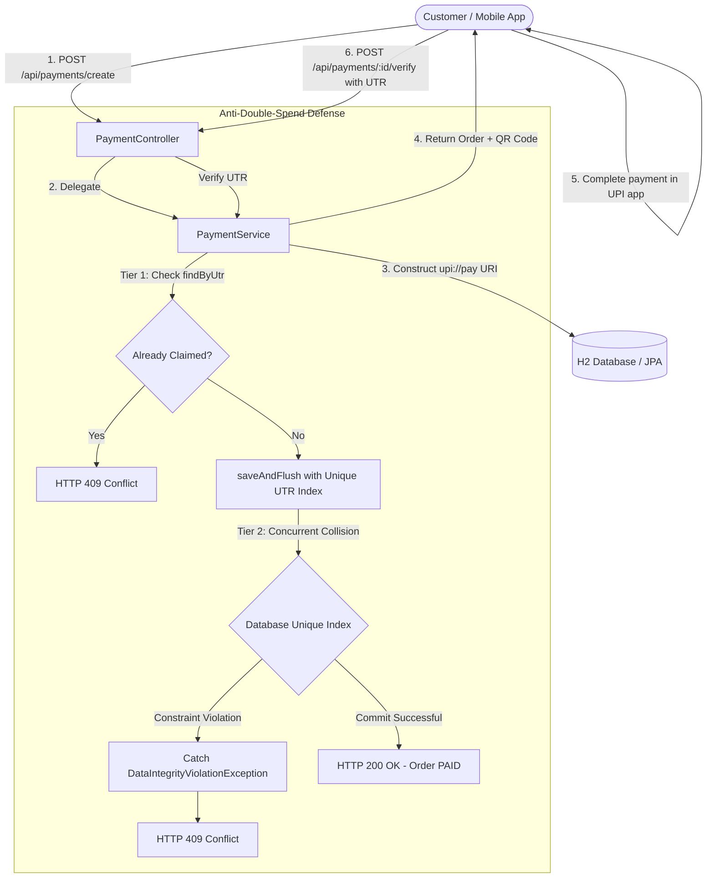
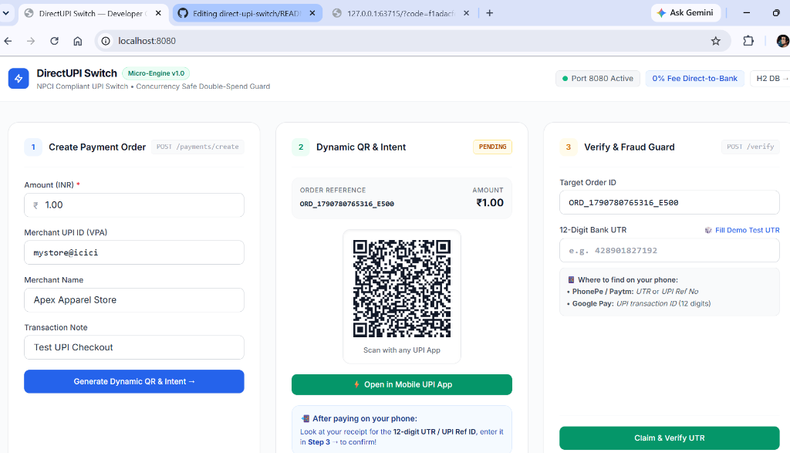
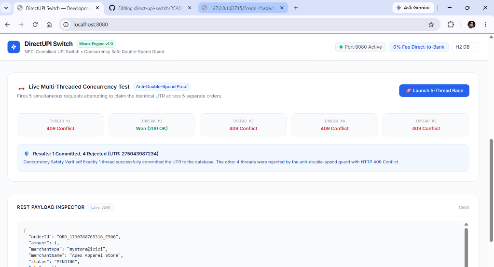

# DirectUPI Switch

A direct-to-bank UPI payment gateway backend built with Spring Boot 3 and Java 17. It generates NPCI-compliant UPI payment intent links (`upi://pay`), serves dynamic QR codes, and handles bank settlement verification (UTR) with built-in concurrency guards to prevent double-spending.

---

## Why I Built This

Most Indian payment gateways (like Razorpay, Cashfree, or PayU) charge a 2% to 3% transaction fee on merchant transactions and hold funds for T+1 or T+2 settlement days. For small merchants and developers, direct UPI (Peer-to-Merchant) has zero transaction fees and settles instantly into the merchant's bank account.

I built this project to explore how a direct UPI switch works without middleman aggregators, and specifically to solve the core engineering challenge that comes with it: **how to prevent fraudulent double-spending when multiple users or retries attempt to claim the exact same bank transaction reference (UTR) at the same time.**

---

## Key Features

- **NPCI Specification Compliant**: Generates standard `upi://pay?pa=...&pn=...&tr=...&am=...&cu=INR` intent URIs compatible with Google Pay, PhonePe, Paytm, BHIM, and Cred.
- **Dynamic QR Generation**: Generates real-time QR codes for desktop checkouts and 1-tap mobile deep links for mobile browsers.
- **Two-Tier Double-Spend Prevention**:
  - *Application Layer*: Fast query check (`findByUtr`) to reject duplicate requests early.
  - *Database Layer*: Strict unique index on the UTR column. Uses `saveAndFlush()` inside a transaction to catch `DataIntegrityViolationException` when concurrent threads race, safely returning HTTP 409 Conflict.
- **Idempotent Verification**: Re-submitting the same UTR for an already verified order returns the existing order state safely without throwing errors.
- **Stress-Tested for Concurrency**: Includes an automated JUnit 5 test firing 10 parallel threads at the exact same millisecond using `CountDownLatch`. Exactly 1 thread commits; the other 9 are rejected.
- **Minimalist Developer Console**: A clean React and Tailwind CSS testing interface with an interactive 5-thread browser race condition runner.

---

## Architecture Overview



---

## Demo & Console Screenshots

### Developer Console & Dynamic QR Checkout
The developer console generates the standard NPCI intent URI (`upi://pay`), renders a real-time scannable QR code, and provides 1-tap mobile deep linking:



### Live Concurrency & Double-Spend Defense
Demonstrating real-time race condition prevention in the browser: 5 parallel requests attempt to claim the identical UTR across 5 separate orders simultaneously. Exactly 1 thread commits (`200 OK`), while 4 are intercepted and rejected (`409 Conflict`):



---

## The Concurrency Challenge: Double-Spending

When a customer pays via UPI, their bank issues a unique 12-digit UTR (Unique Transaction Reference). To claim an order, the customer submits this UTR.

### The Race Condition Scenario
If two concurrent requests (such as an automated attack or duplicate network retries) submit the same UTR at the exact same time:
1. Thread A and Thread B both query `orderRepository.findByUtr("428901827192")`.
2. Because neither transaction has committed yet, both queries return empty.
3. Both threads mark different orders as `PAID`.
4. **Result**: Two separate orders are fulfilled for the price of a single bank transaction.

### How DirectUPI Solves It
1. **Tier 1 (In-Memory / Fast Fail)**: The service first queries the database. If an order with this UTR already exists in a committed state, it throws an `IllegalStateException` immediately.
2. **Tier 2 (Database Constraint & Atomic Flush)**: The `utr` column has a unique database index. Instead of waiting for Hibernate's lazy flush at the end of the transaction, the service explicitly executes `saveAndFlush()`. When two threads collide, the database engine enforces the constraint and throws a `DataIntegrityViolationException`.
3. **Clean Exception Translation**: `GlobalExceptionHandler` intercepts the exception and maps it to a standardized HTTP 409 Conflict response.

### Automated Test Proof
In [`PaymentConcurrencyTest.java`](src/test/java/com/directupi/backend/PaymentConcurrencyTest.java), 10 worker threads are synchronized with a `CountDownLatch` and triggered concurrently:

```java
@Test
void testConcurrentDoubleSpendPrevention() throws InterruptedException {
    int threadCount = 10;
    String sharedUtr = "554433221100";
    
    CountDownLatch startSignal = new CountDownLatch(1);
    CountDownLatch doneSignal = new CountDownLatch(threadCount);

    for (int i = 0; i < threadCount; i++) {
        final String orderId = orderIds.get(i);
        executor.submit(() -> {
            try {
                startSignal.await(); // All threads release at the exact same millisecond
                paymentService.verifyPayment(orderId, new VerifyPaymentRequest(sharedUtr));
                successCount.incrementAndGet();
            } catch (IllegalStateException | DataIntegrityViolationException e) {
                rejectedCount.incrementAndGet();
            } finally {
                doneSignal.countDown();
            }
        });
    }

    startSignal.countDown();
    doneSignal.await(10, TimeUnit.SECONDS);

    // Exactly 1 thread commits; the other 9 must be rejected
    assertEquals(1, successCount.get());
    assertEquals(9, rejectedCount.get());
}
```

```text
[INFO] Running com.directupi.backend.PaymentConcurrencyTest
[INFO] Tests run: 4, Failures: 0, Errors: 0, Skipped: 0
[INFO] BUILD SUCCESS
```

---

## API Reference

### 1. Create Payment Order
`POST /api/payments/create`

**Request:**
```json
{
  "amount": 299.00,
  "merchantVpa": "mystore@icici",
  "merchantName": "Apex Apparel",
  "note": "Order #7189 Payment"
}
```

**Response (HTTP 201 Created):**
```json
{
  "orderId": "ORD_1727701928123_4A8F",
  "amount": 299.00,
  "merchantVpa": "mystore@icici",
  "merchantName": "Apex Apparel",
  "status": "PENDING",
  "utr": null,
  "upiIntentUri": "upi://pay?pa=mystore%40icici&pn=Apex%20Apparel&tr=ORD_1727701928123_4A8F&tn=Order%20%237189%20Payment&am=299.00&cu=INR",
  "createdAt": "2026-09-30T19:05:00",
  "paidAt": null
}
```

---

### 2. Verify Payment (Claim UTR)
`POST /api/payments/{orderId}/verify`

**Request:**
```json
{
  "utr": "428901827192"
}
```

**Response (HTTP 200 OK):**
```json
{
  "orderId": "ORD_1727701928123_4A8F",
  "amount": 299.00,
  "merchantVpa": "mystore@icici",
  "merchantName": "Apex Apparel",
  "status": "PAID",
  "utr": "428901827192",
  "upiIntentUri": "upi://pay?...",
  "createdAt": "2026-09-30T19:05:00",
  "paidAt": "2026-09-30T19:06:12"
}
```

**Conflict Response (HTTP 409 Conflict):**
```json
{
  "timestamp": "2026-09-30T19:06:15",
  "status": 409,
  "message": "Duplicate UTR rejected: Bank reference 428901827192 was already used for order ORD_1727701928123_4A8F"
}
```

---

### 3. Get Payment Status
`GET /api/payments/{orderId}`

Returns the current status, amount, and timestamp of the requested payment order.

---

## Project Structure

```
src/
├── main/
│   ├── java/com/directupi/backend/
│   │   ├── UpiBackendApplication.java
│   │   ├── controller/
│   │   │   └── PaymentController.java          # REST Endpoints
│   │   ├── dto/
│   │   │   ├── CreatePaymentRequest.java       # Request validation
│   │   │   ├── PaymentResponse.java            # Response structure
│   │   │   └── VerifyPaymentRequest.java       # 12-digit UTR regex validator
│   │   ├── entity/
│   │   │   ├── OrderStatus.java                # PENDING, PAID, EXPIRED
│   │   │   └── PaymentOrder.java               # Entity with unique DB indexes
│   │   ├── exception/
│   │   │   └── GlobalExceptionHandler.java     # 400, 404, 409 Conflict handlers
│   │   ├── repository/
│   │   │   └── PaymentOrderRepository.java     # Spring Data JPA
│   │   └── service/
│   │       └── PaymentService.java             # NPCI URI builder + concurrency guard
│   └── resources/
│       ├── application.properties              # Port 8080 & H2 configuration
│       └── static/
│           ├── index.html                      # Minimal HTML mount point
│           └── js/
│               ├── api.js                      # Centralized API client
│               ├── App.js                      # Root application layout
│               ├── CreatePaymentCard.js        # Payment creation card
│               ├── QrCard.js                   # Dynamic QR code display
│               ├── VerifyCard.js               # UTR verification & fraud test
│               └── ConcurrencyRunner.js        # Live 5-thread browser race test
└── test/
    └── java/com/directupi/backend/
        └── PaymentConcurrencyTest.java         # 10-thread CountDownLatch stress test
```

---

## Tech Stack

- **Backend**: Java 17, Spring Boot 3.3.4, Spring Data JPA, Hibernate
- **Database**: H2 (in-memory for development and testing)
- **Validation**: Jakarta Bean Validation (`@NotNull`, `@DecimalMin`, `@Pattern`)
- **Testing**: JUnit 5, Spring Boot Test, Java Concurrency (`CountDownLatch`, `ExecutorService`)
- **Frontend Console**: React 18, Tailwind CSS, QRCode.js

---

## Getting Started

### Prerequisites
- Java 17 or higher
- Git

### Running Locally
1. Clone the repository:
   ```bash
   git clone https://github.com/jatinraj12390/direct-upi-switch.git
   cd direct-upi-switch
   ```
2. Start the application:
   ```bash
   # Windows
   .\mvnw.cmd spring-boot:run

   # macOS / Linux
   ./mvnw spring-boot:run
   ```
3. Open your browser and navigate to:
   - **Developer Console**: `http://localhost:8080`
   - **H2 Database Console**: `http://localhost:8080/h2-console` (JDBC URL: `jdbc:h2:mem:upidb`, User: `sa`, Password: empty)

### Running Automated Tests
```bash
# Windows
.\mvnw.cmd test

# macOS / Linux
./mvnw test
```
